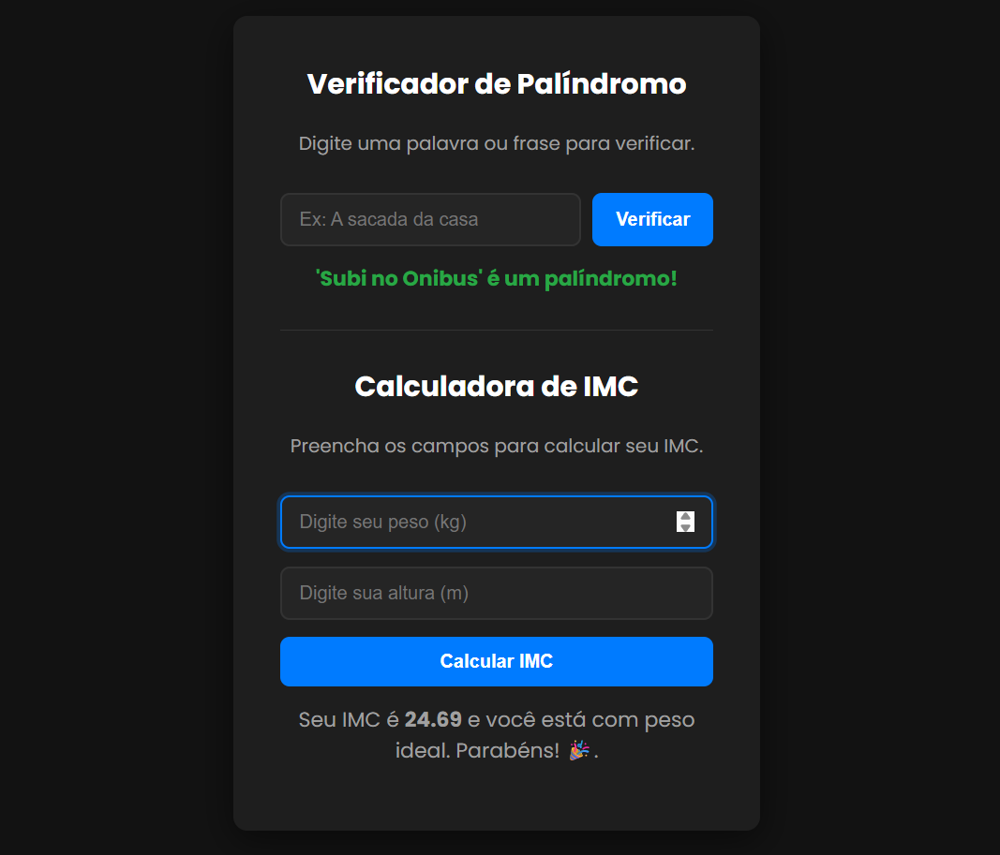

# Ferramentas Online (Atividade CPDI)


Este projeto é uma página web simples que reúne duas ferramentas úteis: uma **Calculadora de IMC** e um **Verificador de Palíndromos**. Ele foi desenvolvido como uma atividade prática para o curso de Programação Web do **CPDI**.

O objetivo foi aplicar e solidificar conceitos fundamentais de **HTML5**, **CSS3** e **JavaScript (ES6+)**, com foco na manipulação do DOM (Document Object Model) para criar uma experiência interativa para o usuário.

## 🚀 Funcionalidades

O projeto consiste em duas ferramentas principais em uma única página:

-   **Calculadora de IMC:**
    -   Calcula o Índice de Massa Corporal (IMC) com base no peso (em kg) e altura (em m) fornecidos.
    -   Fornece uma classificação do resultado de acordo com as diretrizes da OMS (ex: 'Abaixo do peso', 'Peso ideal', 'Obesidade Grau I', etc.).

-   **Verificador de Palíndromo:**
    -   Verifica se uma palavra ou frase inserida é um palíndromo (pode ser lida da mesma forma de trás para frente).
    -   A lógica ignora espaços, acentuações e diferenças entre letras maiúsculas e minúsculas para uma verificação mais robusta.

-   **Interface:**
    -   Layout limpo, responsivo e com um tema escuro (*dark mode*) para conforto visual.

## 🛠️ Tecnologias Utilizadas

As seguintes tecnologias foram usadas na construção do projeto:


## 🖼️ Demonstração

Abaixo, uma imagem de como a aplicação se parece:



## ⚙️ Como Executar o Projeto

Por ser um projeto puramente front-end, não há necessidade de instalação de dependências ou de um servidor complexo.

1.  Clone este repositório para a sua máquina local:
    ```bash
    git clone [https://github.com/seu-usuario/ferramentas-online.git](https://github.com/seu-usuario/ferramentas-online.git)
    ```
    *(Lembre-se de trocar `seu-usuario/ferramentas-online` pela URL do seu repositório)*

2.  Navegue até a pasta do projeto.

3.  Abra o arquivo `index.html` no seu navegador de preferência (Google Chrome, Firefox, etc.).

E pronto! As ferramentas já estarão funcionando.

## 👨‍💻 Autor

Feito por **João Vitor Lemos da Luz**.

